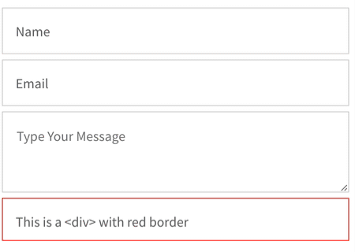

# Vue 3 Float Label

Float Label like package for Vue 3. Written in Composition API and easily customizable with CSS.



```html
<float-label>
  <input type="text" placeholder="Label">
</float-label>
```

## Installation

Install the package via npm:
```sh
$ npm install vue3-float-label
```

## Usage

To use the component locally within a single component:

```html
<template>
  <FloatLabel label="Your Name">
    <input type="text" placeholder="Enter your name" />
  </FloatLabel>
</template>

<script setup>
import { FloatLabel } from 'vue3-float-label';
import 'vue3-float-label/dist/style.css'; // Import the stylesheet
</script>
```
### Props
<hr>

#### `label` 

**String** - If you want a different label than the placeholder text. You can also pass it dynamic text based on another value (i.e. `'Start time on ' + beginningDate` )

Example:
```html
<float-label :label="'Your Name'">
    <input type="text" placeholder="Enter your name">
</float-label>
```
<hr>

#### `float` 

**Boolean** - Use this to manually control when the label is floated. This disables all other detection and `on-focus` prop.

```html
<float-label :float="name ? true : false">
    <input v-model="name" type="text" placeholder="Enter your name">
</float-label>
```
<hr>

#### `on-focus`

**Boolean** - Optional behavior that triggers the float when the field is in focus instead of when content is typed

## Customizing Styles

The `vue3-float-label` component uses CSS variables to allow easy customization of its appearance. You can either copy the styles and modify them yourself, or there are some variables you can override. Below are the default CSS variables defined in the component that you can override in your stylesheet:

```css
:root {
    --vfl-padding-y: 17px;
    --vfl-padding-x: 16px;
    --vfl-label-color: #6c6c6c;
    --border-color: lightgray;
    --border-width: 1px;
}
```


## License

This project is licensed under the MIT License.