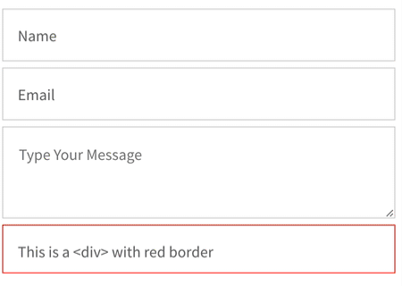

# Vue 3 Float Label

Float Label like package for Vue 3. Written in Composition API and easily customizable with CSS.



```html
<float-label>
  <input type="text" placeholder="Label">
</float-label>
```

## Installation
```sh
$ npm install vue3-float-label
```

### Global
Load plugin in your main js file:

```js
import FloatLabel from 'vue3-float-label'
import "vue3-float-label/dist/style.css"
```

### Local

## Usage


### Props
<hr>

#### `label` 

**String** - If you want a different label than the placeholder text. You can also pass it dynamic text based on another value (i.e. `'Start time on ' + beginningDate` )

Example:
```html
<float-label :label="'Your Name'">
    <input type="text" placeholder="Enter your name">
</float-label>
```
<hr>

#### `float` 

**Boolean** - Use this to manually control when the label is floated. This disables all other detection and `on-focus` prop.

```html
<float-label :float="name ? true : false">
    <input v-model="name" type="text" placeholder="Enter your name">
</float-label>
```
<hr>
#### `on-focus`

**Boolean** - Optional behavior that triggers the float when the field is in focus instead of when content is typed
